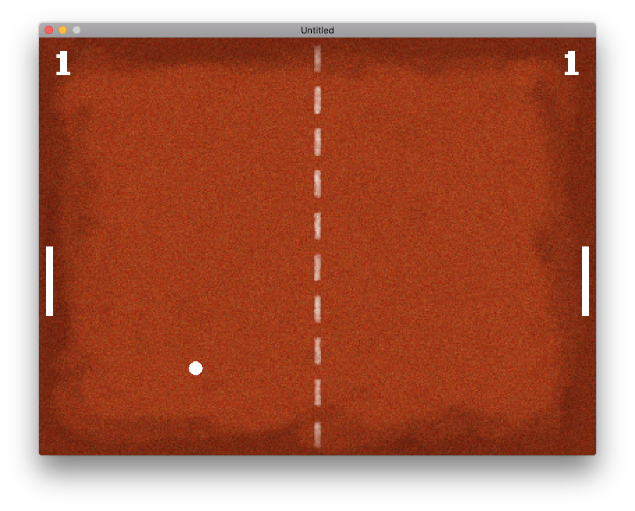
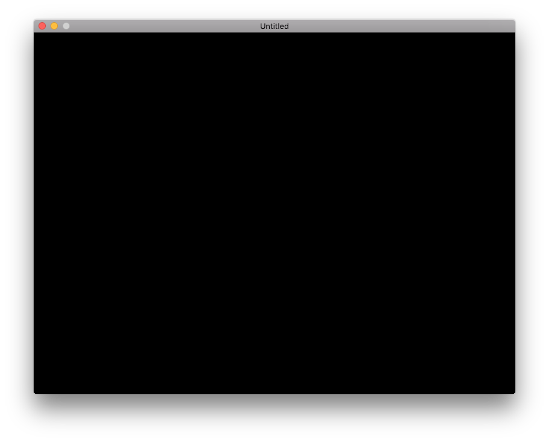
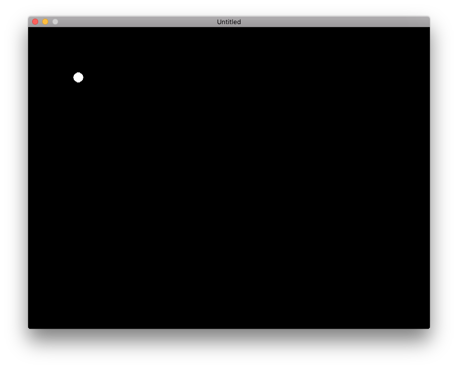
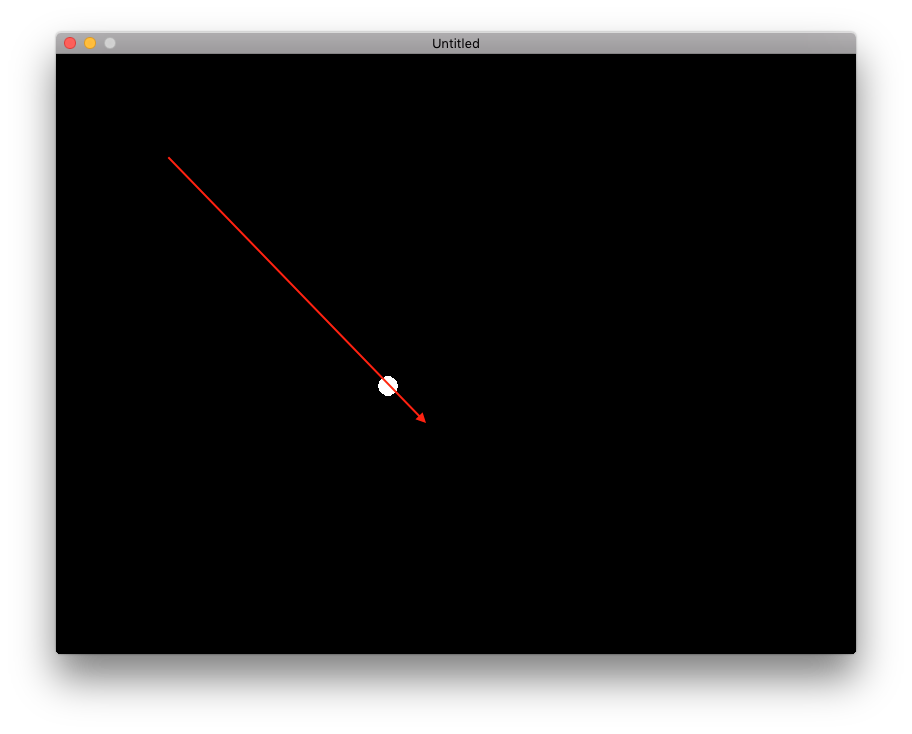
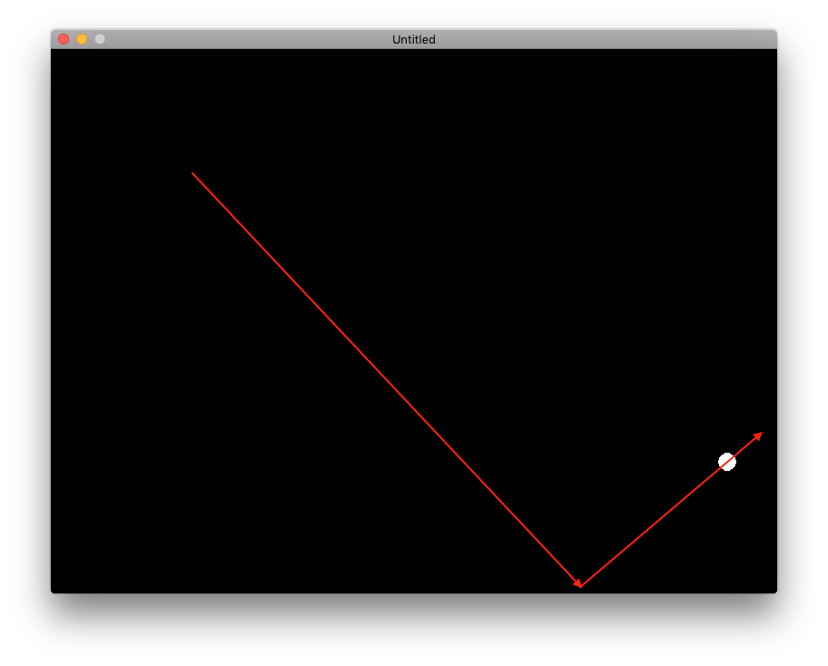
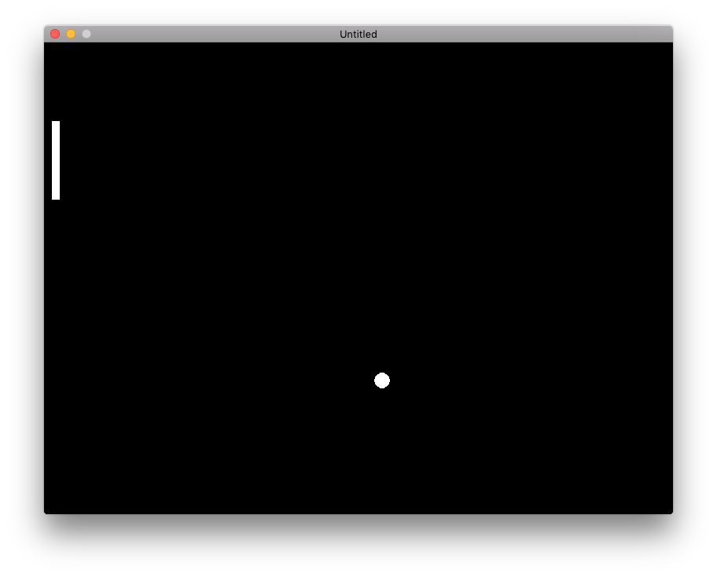
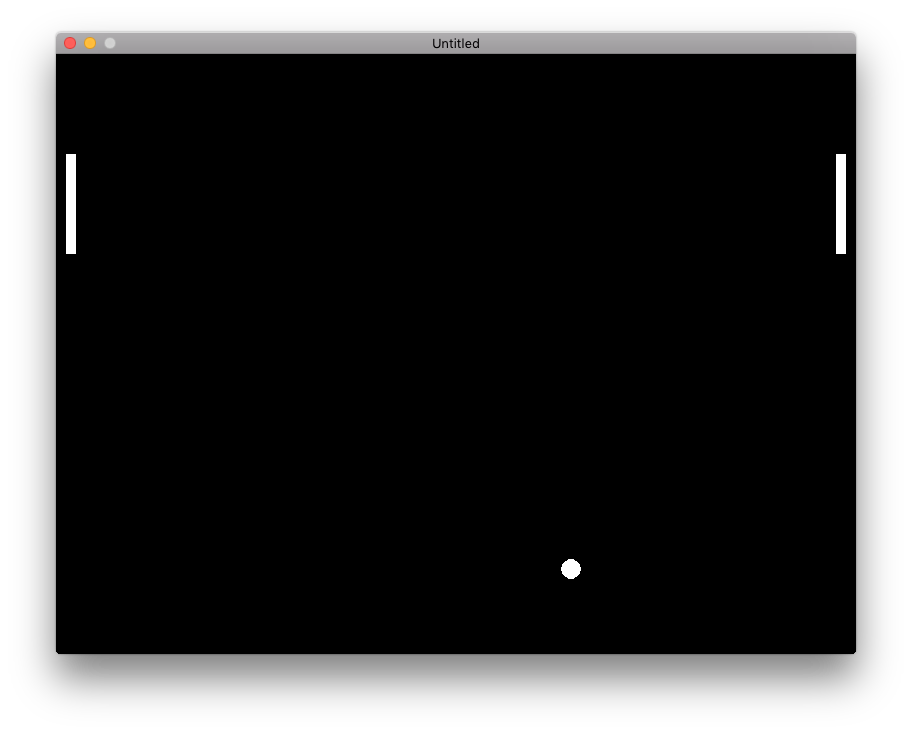
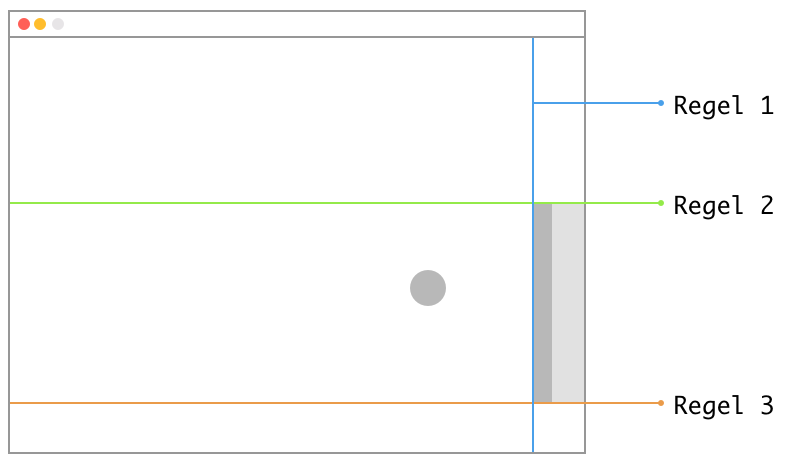

# Pong met Lua en Löve2D {first-page}
## Stap voor stap {first-page}

<br /><br /><br /><br />
<div style="text-align: center;">
  
</div>

<div class="pagebreak"></div>

# 1. Introductie
Met deze handleiding gaan we vandaag aan de slag om  stap voor stap het klassieke spel Pong te bouwen met het game framework Löve2D en de programmeertaal Lua. Mocht je gemist hebben hoe je Löve2D en Lua moet installeren? Kijk dan in de installatie handleiding voor tips!

<span class="bold">Spelregels</span>
De spelregels van onze Pong versie worden vrij eenvoudig! Er zijn twee batjes in het spel, eentje aan de linker kant van het scherm, en eentje aan de rechterkant van het scherm. Het linker batje wordt met `W` en `S` bestuurt, de rechterkant besturen we met de pijltjestoetsen omhoog en omlaag. Natuurlijk is er ook een balletje in het spel die we heen en weer moeten kaatsen met de batjes, maar automatisch stuitert op de boven- en onder randen.

Mocht het balletje niet tegengehouden worden door het batje aan de rechterkant? Dan heeft de speler die het linker batje bestuurt een punt en natuurlijk andersom!

Veel plezier en succes!

<div class="pagebreak"></div>

# 2. Aan de slag!
Om goed van start te kunnen moeten we de volgende dingen doen:
1. Maak ergens een nieuw mapje aan en noem deze bijvoorbeeld `pong`
2. Maak, in dit mapje, een nieuw bestandje met de naam `main.lua`
3. Open `main.lua` in Atom (of een andere code editor)
4. Typ de volgende drie functies in `main.lua` en vergeet vervolgens niet op te slaan:

```lua
function love.load()
end

function love.draw()
end

function love.update()
end
```

De functies `love.load()`, `love.draw()` en `love.update()` worden automatisch door Löve2D aangeroepen wanneer nodig. `love.load()` wordt eenmalig uitgevoerd (bij de start van het spel) - Deze kun je gebruiken voor het inladen van plaatjes, geluiden, lettertypen, enzovoorts.

De functies `love.update()` en `love.draw()` worden kort na elkaar en ongeveer 60x per seconde uitgevoerd. Deze functies gebruik je voor het bewegen en opnieuw tekenen van onderdelen.

<div class="pagebreak"></div>

Om te controleren of je het goed hebt gedaan moet je het mapje `pong` op de app `Love` slepen. Als alles goed is gegaan opent er een zwart scherm zoals hieronder is afgebeeld:

Het scherm blijft zwart omdat de functies, die op de vorige bladzijde hebben gemaakt, nog leeg zijn. In de volgende hoofdstukken gaan we deze functies verder invullen, net zo lang tot we het spelletje Pong hebben gebouwd!

<div class="pagebreak"></div>

## 3. Balletje
Pong is natuurlijk nergens zonder het balletje wat heen en weer gestuitert moet gaan worden. Laten we bij het begin beginnen, een balletje op het scherm tekenen!

```lua
function love.draw()
  love.graphics.circle("fill", 100, 100, 10)
end
```

Schrijf in de `love.draw()` functie de regel zoals hierboven staat beschreven. 

`love.graphics.circle()` is een functie die Löve2D vertelt dat we een circel willen tekenen. Alles tussen de haakjes `(` en `)` zijn de argumenten die we aan de functie meegeven.{info}

`fill` zegt dat we de circel willen inkleuren, `100` en `100` zegt iets over de positie waar de de circel willen tekenen (x = 100 pixels en y = 100pixels vanaf links boven) en de laatste, `10`, zegt iets over de radius van de circel (afstand in pixels vanaf middenpunt tot aan de rand). 

Wil je weten welke functies er nog meer zitten in Love.graphics? Neem dan een kijkje in de documentatie: <span class="green">https://love2d.org/wiki/love.graphics</span>


<div class="pagebreak"></div>

Vergeet `main.lua` vervolgens niet op te slaan en start je spelletje. Je zult nu zien dat er een circel wordt getekent op 100 bij 100 pixels vanaf de linker bovenhoek van het scherm.


Maar! Zoals je ziet, blijft het spalletje stil staan op dezelfde positie. Dit is natuurlijk nogal saai, in het volgende hoofdstuk gaan we het balletje laten bewegen!

<div class="pagebreak"></div>

## 4. Balletje bewegen
Zoals je in hoofdstuk 1 hebt gelezen wordt de `love.draw()` functie automatisch ongeveer 60 keer per seconde aangeroepen. All regels code binnen deze functie worden dus 60 keer per seconde uitgevoerd om zo 1 frame te tekenen. Handig! Want als we nu ieder frame het balletje ietsje opschuiven, beweegt het balletje!

Om dit te doen moeten we van de positie van het balletje een variabele maken. In Löve2D worden de meeste variabelen in de `love.load()` aangemaakt, kun je hun waarden aanpassen in `love.update()` en vervolgens gebruiken in `love.draw()`.

```lua
function love.load()
  balPositieX = 100
  balPositieY = 100
end

function love.draw()
  love.graphics.circle("fill", balPositieX, balPositieY, 10)
end
```

In de bovenstaande code maken we in de `love.load()` functie twee variabelen aan. Eentje voor elke as (X-as en Y-as) met de namen `balPositieX` en `balPositieY` met de waarde `100`. Vervolgens hebben we deze variabelen in de `love.graphics.circle()` functie gebruikt op de plek waar eerst de X en Y met 100 stonden aangegeven.

Als je nu het spelletje start zul je nog geen verschil zien. Omdat we de variabelen `balPositieX` en `balPositieY` nog niet veranderen wordt ons balletje iedere keer weer op dezelfde plek getekent.

<div class="pagebreak"></div>

Om het balletje te laten bewegen moeten we de waardes in variabele `balPositie` aanpassen, dit doen we in de `love.update()` functie die tot nu toe nog leeg was.

```lua
function love.update()
  balPositieX = balPositieX + 1
  balPositieY = balPositieY + 1
end
```
In bovenstaande functie hogen we de variabelen `balPositieX` en `balPositieY` telkens met 1 op. Als je nu je spelletje start, zul je zien dat het balletje beweegt:



<div class="pagebreak"></div>

## 5. Stuiteren
Maar als je eventjes wacht, zul je zien dat het balletje aan de onderkant van je scherm verdwijnt en nooit meer terug komt. Laten we er nu voor gaan zorgen dat het balletje aan de boven- en onderkant van het scherm van richting veranderd als het de randen raakt.

Om dit te kunnen doen moeten we de beweging van de bal (richting + snelheid) los opslaan in nieuwe variabelen. Omdat een balletje zowel een richting op de X-as heeft als op de Y-as moeten we weer twee variabelen maken:

```lua
function love.load()
  balPositieX = 100
  balPositieY = 100

  balBewegingX = 5
  balBewegingY = 5
end
```

Vervolgens kunnen we deze variabelen gebruiken in de `love.update()` functie:

```lua
function love.update()
  balPositieX = balPositieX + balBewegingX
  balPositieY = balPositieY + balBewegingY
end
```

Als je het spelletje nu start, stuitert het balletje nog niet - maar als je goed kijkt zul je wel zien dat het balletje nu wel sneller beweegt! Dit komt omdat we nu de waarden uit `balBewegingX` en `balBewegingY` gebruiken bij iedere `love.update()`.

<div class="pagebreak"></div>

Om het balletje nu te laten stuiteren moeten we controleren of het balletje aan de boven- of onderkant de rand raakt. Als dat zo is, moeten we de richting op de Y-as omdraaien:

```lua
function love.update()
  balPositieX = balPositieX + balBewegingX
  balPositieY = balPositieY + balBewegingY

  if balPositieY >= love.graphics.getHeight() or balPositieY <= 0 then
    balBewegingY = balBewegingY * -1
  end

end
```

De eerste twee regels in de functie zijn nog hetzelfde, maar de drie regels eronder zijn nieuw! Met `if` kunnen we controleren of een bepaalde voorwaarde `waar` is. [`ALS... DAN...`]-blokjes, zoals we die kennen in Scratch, werken op een zelfde manier.

In het code voorbeeld hierboven controleren we of de `balPositieY` gelijk is aan, of groter is dan ( >= ) de hoogte van het scherm (`love.graphics.getHeight()`). OF als de `balPositieY` kleiner is dan, of gelijk is aan 0 ( <= ), DAN voeren we het stuk code uit tussen de `then` en `end` keywords.

Als het balletje de boven- of onderkant raakt willen we de richting op de Y-as omdraaien, dit doen we door het te vermenigvuldigen met -1. 5 * -1 is immers -5, wat betekent dat per frame het balletje 5 pixels omhoog gaat, in plaats van naar beneden.

<div class="pagebreak"></div>

Als we het spelletje nu starten, zul je zien dat het balletje 1 keer stuitert aan de onderkant en vervolgens aan de rechterkant het scherm verlaat.



<div class="pagebreak"></div>

# 6. Batjes tekenen

Pong is natuurlijk niet compleet zonder dat we het balletje weer de andere kant op kunnen stuiteren! Daar daar komen de batjes om de hoek kijken!

```lua
function love.draw()
  love.graphics.circle("fill", balPositieX, balPositieY, 10)
  love.graphics.rectangle("fill", 10, 100, 10, 100)
end
```

In de `love.draw()` functie roepen we nu nog een extra functie aan. Naast dat we een `circle` tekenen, tekenen we nu ook een rechthoek (`rectangle`). De `fill` parameter kennen we nog. De volgende parameters zijn: positie op X-as (10px), positie op Y-as (10px), breedte (10px) en als laatste de hoogte (100px).

<div class="center"></div>
<!---->

<div class="pagebreak"></div>
Het zelfde truucje kunnen we uithalen om een batje aan de rechterkant van het scherm te tekenen!

```lua
function love.draw()
  love.graphics.circle("fill", balPositieX, balPositieY, 10)
  love.graphics.rectangle("fill", 10, 100, 10, 100)
  love.graphics.rectangle("fill", love.graphics.getWidth()-20, 100, 10, 100)
end
```
De onderste regel maakt nogmaals een batje, maar gebruikt in plaats van de eerste `10` voor de positie op de X-as, de breedte van het scherm min 20 (breedte batje + afstand tot rand = 20). Je ziet nu twee batjes op het scherm.



<div class="pagebreak"></div>

## 7. Batjes bewegen
Net als met het balletje is het natuurlijk nogal saai als de batjes stil blijven staan. Om de batjes te kunnen bewegen moeten we weer twee variabelen hebben voor de Y-posities van beide batjes. Weet je nog hoe dit moet?

```lua
linkerBatjeY = 100
rechterBatjeY = 100
```

Voeg bovenstaande regels toe aan `love.load()` en vervang vervolgens in `love.draw()` de Y-as posities (100) van de batjes:

```lua
love.graphics.rectangle("fill", 10, linkerBatjeY, 10, 100)
love.graphics.rectangle("fill", love.graphics.getWidth()-20, rechterBatjeY, 10, 100)
```

Om de batjes vervolgens te laten bewegen hoeven we alleen nog maar de waarde van de variabelen aan te passen in `love.update()`.

We moeten twee batjes laten bewegen voor twee verschillende spelers. Dus we hebben vier toetsen nodig. Wat als we nou `W` en `S` gebruiken voor op en neer voor het linker batje en de `up` en `down` pijltjes toetsen voor het rechter batje.  

<div class="pagebreak"></div>

Voeg onderstaande code toe onderaan `love.update()`
```lua
  if love.keyboard.isDown("s") then
    linkerBatjeY = linkerBatjeY + 5
  elseif love.keyboard.isDown("w") then
    linkerBatjeY = linkerBatjeY - 5
  end
```

Zoals we bij het stuiteren al gezien hebben, kunnen we met `IF` code uitvoeren als bepaalde voorwaarden `waar` zijn. Zo heeft Löve2D een handige functie om te kijken of er een toets is ingedrukt. Verschillende `ALS...DAN...` blokken kunnen we aan elkaar koppelen met `elseif`, wat eigenlijk betekent `OF ALS ... DAN ...`

Zo controleren we in bovenstaande code op `ALS S-TOETS INGEDRUKT, DAN..` en verhogen we vervoglens de Y-positie van het linker batje met 5 (batje gaat naar beneden). Als de S-toets niet is ingedrukt, dan is misschien de W-toets wel ingedrukt. Dit controleren we met `OF ALS W-TOETS INGEDRUKT, DAN...` en vervolgens verlagen we de Y-positie van het batje met 5 (batje gaat omhoog).

Probeer nu zelf het rechter batje te besturen! Tip; het blok code hierboven kun je kopieren, je moet alleen wel op een andere toets controleren en een andere variabele aanpassen. Kijk voor een lijst met hoe je op andere toetsen kunt controleren op: <span class="green">https://love2d.org/wiki/KeyConstant</span>

Als alles is goed gegaan kun je beide batjes los van elkaar bewegen met W/S en UP/DOWN toetsen.

<div class="pagebreak"></div>

## 8. Terug stuiteren
Waarschijnlijk heb je het al gezien, maar het balletje trekt zich helemaal niets aan van onze batjes, gaat er dwars doorheen en verdwijnt vervolgens uit het scherm! Dit moeten we natuurlijk oplossen!

Wanneer moeten we het balletje nou precies terugstuiteren? De regels hiervoor zijn vrij eenvoudig. Laten we er eens naar kijken!



Zoals je in bovenstaande tekening kan zien zijn er drie 'grenzen' waar we naar moeten kijken. Deze grenzen zijn in de tekening hierboven aangegeven met een blauwe, groene en oranje lijn. 

Zodra het balletje over alle drie de grenzen tegelijk is (en dus in het grijze gebied zit) dan moeten we het balletje terugstuiteren.

<div class="pagebreak"></div>
Uit de tekening op de vorige bladzijde kunnen we de drie regels opschrijven als volgt. Het balletje moet terugstuiteren als ...

1. ... het rechts van de blauwe lijn is EN
2. ... het onder de groene lijn is EN
3. ... het boven de oranje lijn is

Tip: Volg de regels zelf maar met je vinger op het plaatje op de vorige bladzijde, je zult zien dat je dan automatisch in het grijze vlak komt. {info}

Nou heeft een computer natuurlijk geen idee wanneer het balletje over een groene lijn gaat, achter de blauwe zit of nog net boven de oranje lijn. Deze logica moeten we zelf programmeren. We moeten de regels zoals hierboven dan ook een beetje anders opschrijven zodat de computer het ook begrijpt.

Het balletje moet terug stuiteren als ...

1. ... het op de X-as 20 pixels of minder van de rand zit EN
2. ... het op de Y-as onder de bovenkant van het batje zit EN
3. ... het op de Y-as boven de onderkant van het batje zit

Hoe dat er dan in code uit ziet, zien we op de volgende bladzijde!

<div class="pagebreak"></div>

Nu we precies duidelijk hebben <span class="bold">wanneer</span> het balletje moet terugstuiteren, kunnen we ons nu bezig houden met <span class="bold">hoe</span> we dat gaan doen. Want als je de regels eenmaal begrijpt, is de code eigenlijk heel simpel!

In de `love.update()` functie voegen we de volgende regels onderaan toe:

``` lua
if balPositieX >= love.graphics.getWidth() - 20 
  and balPositieY >= rechterBatjeY 
  and balPositieY <= rechterBatjeY + 100 then

  balBewegingX = balBewegingX * -1
end

if balPositieX <= 20 
    and balPositieY >= linkerBatjeY 
    and balPositieY <= linkerBatjeY + 100 then

  balBewegingX = balBewegingX * -1
end
```

Het bovenstaande code voorbeeld bestaat uit twee `if` blokken. De bovenste `if` controleert het rechter batje, het tweede `if` blok controleert het linker batje.

De eerste regel van het `IF` blok controleert onze eerste regel; is de bal rechts van de blauwe lijn? 
Vervolgens controleren we of het balletje onder de groene lijn is (`balPositieY >= rechterBatjeY`) en daarna kijken we of het balletje boven de onderkant van het batje is (`balPositieY <= rechterBatjeY + 100`) dat is in onze tekening de oranje lijn.

Met `and` tussen de verschillende regels (statements) zorg je er voor dat ze alledrie waar moeten zijn voordat we de regel daaronder, het omdraaien van de richting van het balletje, uitvoeren. 

Omdraaien van de richting doen we, net als bij de boven- en onder randen, door `balBewegingX` te vermenigvuldigen met -1.

Wil je meer weten over if-statements en operators? In de documentatie van lua is hier een goede uitleg over te vinden: <span class="green">https://www.lua.org/pil/4.3.1.html</span> (if-statements) 
en <span class="green"> https://www.lua.org/pil/3.2.html </span> (operators){info}

<div class="pagebreak"></div>

## 9. Balletje resetten
Als je je spelletje start zul je zien dat we er bijna zijn! Het balletje beweegt en stuitert op de boven en onderkant. De batjes bewegen en het balletje stuitert op de batjes. Maar wat gebeurt er als het balletje het batje mist? Dan zijn we het balletje alsnog kwijt! Eigenlijk zouden we het balletje weer in het midden moeten zetten zodra het balletje het scherm verlaat.

Voeg hiervoor deze code toe onderaan `love.update()`:

```lua
if balPositieX <= 0 then
  balPositieX = love.graphics.getWidth() / 2
  balPositieY = love.graphics.getHeight() / 2
elseif balPositieX >= love.graphics.getWidth() then
  balPositieX = love.graphics.getWidth() / 2
  balPositieY = love.graphics.getHeight() / 2
end
```

De eerste regel van de code hierboven controleert of het balletje aan de linkerkant het scherm verlaten heeft. Als dat het geval is, zet dan de positie van het balletje weer terug naar het midden van het scherm. 

De vierde regel controleert of de `balPositieX` groter of gelijk is aan breedte van het scherm (rechter kant), als dat het geval is zet hij het balletje ook weer terug naar het midden.

Midden wordt hier bepaald door `balPositieX = breedte van scherm delen door twee` en `balPositieY = hoogte van scherm delen door twee`

<div class="pagebreak"></div>

## 10. Nu jij!
Dat was het laatste onderdeel van pong! Je zult zien dat als je je spelletje nu start, je een werkende versie hebt van pong. Hij is alleen nog wel erg kaal! Aan jou om deze versie beter te maken dan alle andere pong's! Hier alvast een paar extra opdrachten voor je:

<span class="bold">1. Zorg dat de score wordt bijgehouden!</span>
Net zoals voor de positie van het balletje of de batjes, kunnen we een variabele maken voor het bijhouden van de score. Met `love.graphics.print()` kun je deze op het scherm zetten (<span class="green">https://love2d.org/wiki/love.graphics.print</span>)

<span class="bold">2. Achtergrond plaatje</span>
Op de eerste pagina staat natuurlijk een mooie achtergrond ingesteld voor ons spelletje. Om dit te kunnen doen, kijk eens naar <span class="green"> https://love2d.org/wiki/love.graphics.newImage </span> en <span class="green"> https://love2d.org/wiki/love.graphics.draw </span>

<span class="bold">4. Geluiden bij stuiteren</span>
Kijk voor het afspelen van geluiden naar <span class="green"> https://love2d.org/wiki/love.audio </span> en <span class="green"> https://love2d.org/wiki/Source </span>.

<span class="bold">5. Wat kun je zelf nog verzinnen?</span>
Verzin zelf nog wat leuke toevoegingen om jouw pong nog vetter te maken!

Kom je er niet uit? Vraag het aan je buurman of buurvrouw of vraag het een mentor!


<div class="pagebreak"></div>

# Colofon

Dit document is geschreven door Tiemen Waterreus voor CoderDojo Rotterdam (SF). Mocht je na het lezen van dit document vragen of opmerkingen hebben dan zijn die utieraard welkom via <span class="green">contact@coderdojo-rotterdam.nl</span>!